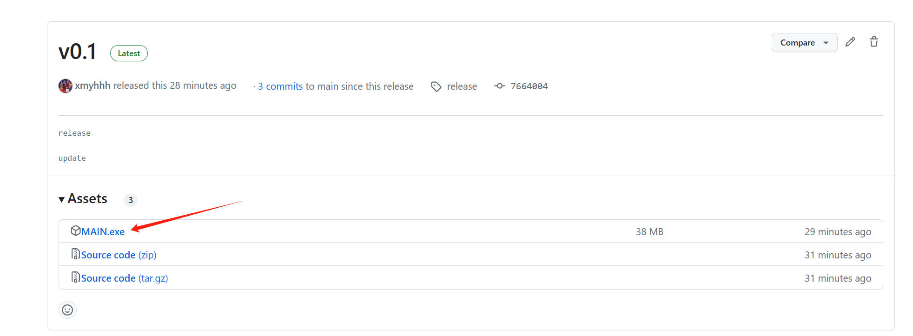
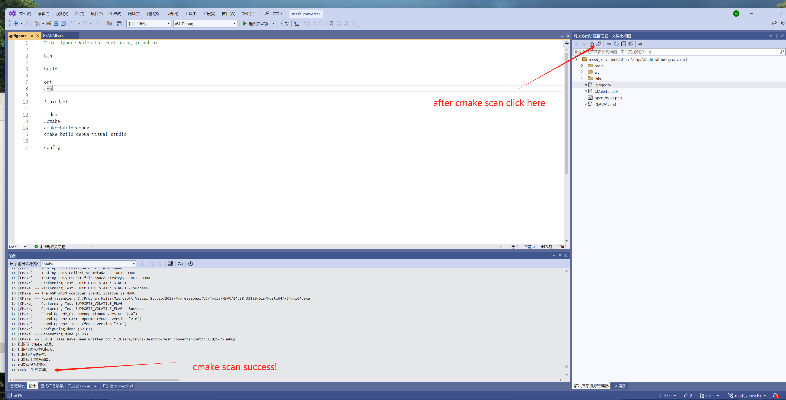
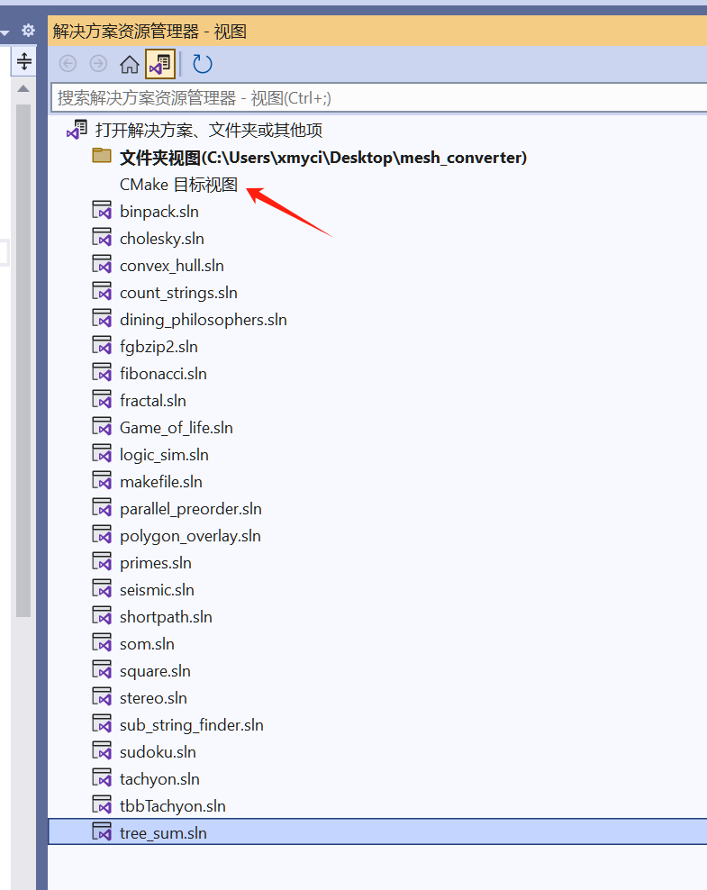
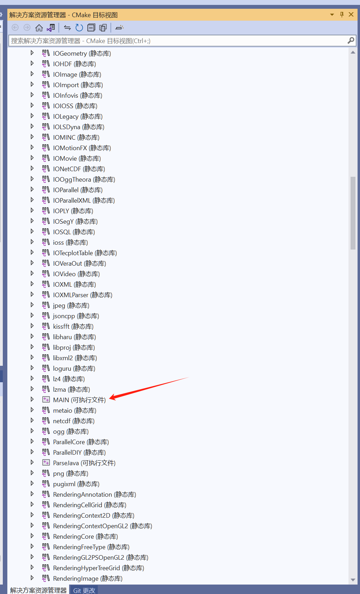
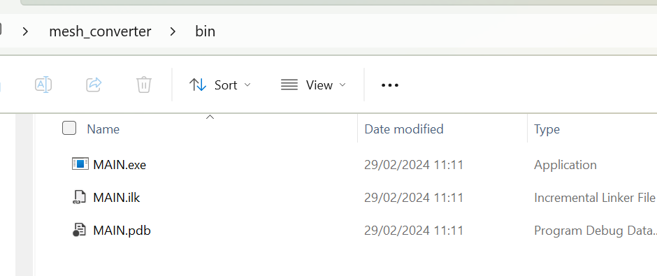

# f3grid converter

convert .f3grid file to vtu and export six box-like boundary surface if possible


## How to use this tool
* By download release: if you don't want to build code, you can download pre-build exe file directly, [link here](https://github.com/xmyhhh/f3grid_converter/releases)

  <div align=center>
  
  </div>
* By compile code: the code compile is simple(A standard cmake project compile pipeline) and all dependency is included in this repository already(you dont need to manuly config any environment things or external lib), below are some step to compile this code on windows PC
  - install git/vs studio(with c++ desktop development kit and cmake install)
  - git clone this repository by cmd `git clone https://github.com/xmyhhh/f3grid_converter.git`
  - open clone folder by vs studio, if everything is ok, a cmake scan will automaticaly begin
    <div align=center>
      
    </div>
    <div align=center>
      
    </div>

  - after cmake scan, find the `MAIN` target
    <div align=center>
      
    </div>
    <div align=center>
      
    </div>

  - click and build/debug the `MAIN` target
    <div align=center>
      
    </div>
    <div align=center>
      
    </div>


## Usage
* Step 1: Run the.exe directly, which will generate a.json file in the same location as the.exe.
* Step 2: Edite the generated .json file. for example:
  - `input_file_path` is the .f3grid file path
  - `export_six_surface_setting` is the axis rotation when export six boundary surface
  - `export_face_related` is the switch that controls whether export six boundary surface
  - `export_face_related` is the switch that controls whether export face related things
```json
{
    "export_six_surface_setting": {
        "r_x": -50,
        "r_y": 0,
        "r_z": 0
    },
    "input": {
        "input_file_path": [
            "C:\\Users\\xmyci\\Documents\\WeChat Files\\wxid_jsf6r3h7bf0x22\\FileStorage\\File\\2024-02\\model(group).f3grid"
        ]
    },
    "output": {
        "export_face_related": false,
        "export_six_surface": true,
        "save_output_path": "."
    }
}
```
* Step 3: Run the.exe again, and the vtu will be generated in the path setting by `save_output_path`

